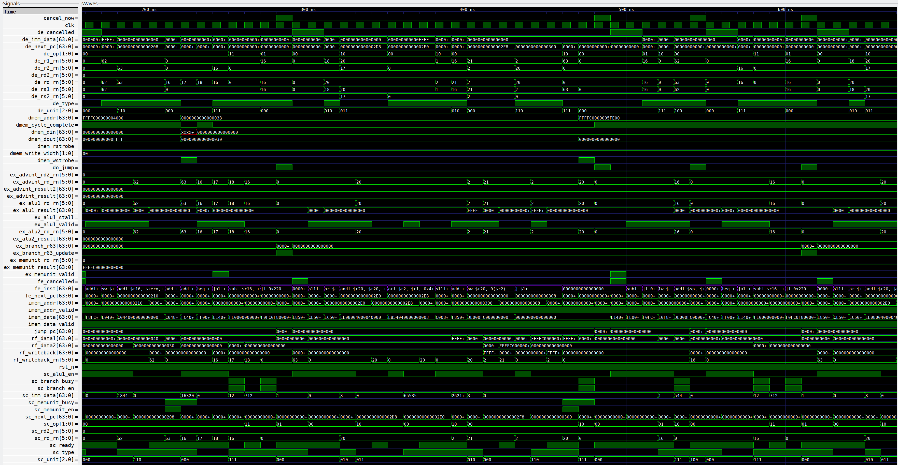

Raisin64 CPU
============

Purpose
-------

The Raisin64, like most computer processors, is a collection of various processing elements and memories, creating what is presently a pipelined 64-bit Harvard RISC architecture.  While the initial semester of work focused on getting the design off the ground: designing the instruction set, laying out the execution pipeline, preparing the tools, etc., the eventual goal is to create a CPU capable of running a modern general purpose operating system.  This also includes porting all the required debug utilities, assembler, compiler, and other tools necessary to accomplish that goal.

Given the relative paucity of new ISAs, there seems to be little in the way of academic coursework and technical documentation on the bootstrapping process which must occur to make a new architecture useful.  This project is the result of those observations, and provides me with experience beyond just computer architecture, including those software and hardware tasks necessary to actually do something useful with a CPU.

All of that said, the Raisin64 is an initial attempt at understanding pipelined processors, the trades between register count, opcode density, and speed, as well as being a platform for further experimentation.  Envisioned as a pure 64-bit machine, the Raisin64 has no legacy instruction set to support and can start as a clean slate.

Anticipating that an out-of-order design with register renaming would be too much work for a semester long project, the Raisin64 ISA has a large architectural register set with 63 64-bit registers instead (Register 0 is always 0).  These additional registers have consequences for the instruction format, requiring 6 bits to represent.  While a 64-bit instruction word can easily store that, a fixed 64-bit instruction size would be immensely wasteful in terms of memory and cache utilization.

I decided to create a compact instruction format that allows certain instructions to have 16-bit representations and nearly all to have 32-bit representations, with only a few actually requiring the full 64-bit word (such as :ref:`Jump Immediate <cpu/isa/ji:JI - Jump Immediate>`).  Of course, a fixed instruction word is convenient, so the Raisin64's decode stage is designed to expand the 16 and 32-bit instructions into the full 64-bit canonical form as it arrives.  This also allows savings on cache and memory while having a simpler internal processing pipeline.

Full details on the instruction word formatting are documented in the :ref:`Raisin64 Instruction Set <cpu/isa:Raisin64 Instruction Set>` section.

Pipeline Stages
---------------

.. image:: _static/raisin64block.png
    :width: 100%
    :alt: High-level CPU block diagram

The Raisin64 pipeline connects together the processing elements detailed in later sections.  Having seen several academic and open-source processor designs, the processing pipeline tends to be one of the more confusing modules to look at, not because of algorithmic complexity but due to the large number of signals moving around the design.

Special effort was made to minimize the number of delay registers and extraneous signals between the various pipeline stages, keeping the design understandable and relatively easy to debug.

Below is an example of the Raisin64's pipeline executing the :ref:`VGA Demo Program <software:VGA Demo Program>`:

To assist with organization, signals in :ref:`pipeline.v <cpu/modules/pipeline:pipeline.v>` are generally prefixed with the module that generated the signal:

============== =============
**Stage:**     **Prefix:**
-------------- -------------
Fetch          fe_*
Decode         de_*
Register File  rf_*
Scheduler      sc_*
Execution Unit ex_unitName_*
============== =============

Fetch Unit
++++++++++

The :ref:`fetch unit <cpu/modules/fetch:fetch.v>` is responsible for maintaining the program counter, calculating the next linear instruction's address based on the size of the present instruction, and muxing in the jump/branch destination address.

Fetch is relatively straightforward although it does need to support stalls from both the memory interface (as the data may not be ready) and from deeper in the pipeline (should an instruction need to wait for execution resources).

Decode Unit
+++++++++++

The :ref:`decode unit <cpu/modules/decode:decode.v>` performs a hardwired conversion between the input instruction word and the control signals used by later pipeline stages.  Starting with one or more instruction words left-aligned from the fetch unit, the decode unit passes the instruction simultaneously to the :ref:`instruction canonicalizer <cpu/modules/de_canonicalize:de_canonicalize.v>` for conversion into the native 64-bit instruction word and to an :ref:`invalid opcode detector <cpu/modules/de_badDetect:de_badDetect.v>` which is unused (owing to the lack of interrupts/exceptions).

Presently, the decode unit decodes a single instruction at a time, limiting the issue rate of the processor to 1 at most.  Given the overall complexity of the design for a single semester project, it was decided to defer the multi-issue capability until next semester when the caches and fetch system will be written and adapted to wider access.

The decode unit also selects the two source register numbers for any instruction.  While these generally map exactly to the ``$rs1`` and ``$rs2`` fields, opcodes like :ref:`Branch if Equal <cpu/isa/BEQ:BEQ - Branch if Equal>` use two registers and the immediate field.  To avoid creating another instruction format, the usual :ref:`32R <cpu/isa:32R - 32-bit Register Format>` format can be used, directing the register file to load from ``$rd`` instead.

There is no scenario where more than two registers are loaded, so the decode unit publishes zero, one, or two register numbers for the register file to load in the next stage.

Register File
+++++++++++++

The :ref:`register file <cpu/modules/regfile:regfile.v>` is a 63 entry, 64-bit dual read-port, single write-port RAM.  The processing pipeline was architected to allow for a single cycle of read latency from the register file.  This allows the otherwise large register file to map to higher density memories like distributed RAM or block RAM in FPGA implementations.

The register file is also designed to allow write values to fall through to the read port should another instruction be requesting the same register value.  This data forwarding can save an otherwise wasted cycle.

Schedule Unit
+++++++++++++

The :ref:`scheduler <cpu/modules/schedule:schedule.v>`, or issue unit as it is conventionally known, runs concurrent to the register file on a given time-step.  This allows the register file time to gather the data required for an operation while the scheduler is making a decision whether or not to issue that instruction.

As execution units are allowed to take more than one cycle to complete, the scheduler tries to issue instructions up to the point where there are either no free execution resources or one of the source operands is going to be written by an in-progress instruction that hasn't finished.

This is accomplished by marking those destination register numbers busy when they are issued and unmarking them when they are written back to the register file.  A limited non-speculating in-order issue with out-of-order execution is a side-effect of the arrangement assuming register numbers don't overlap.  Consider the following:

.. code-block:: gas

    lw $r2, ($r1)      #Load data at address $r1 into $r2
    add $r3, $r4, $r5  #Add $r4 and $r5, storing in $r3
    add $r4, $r5, $r6

It is very likely that the ADD instructions will finish executing before the LW.  The scheduler will identify LW affects only ``$r2``, and that it is not used in the subsequent instructions.  Because instructions are always *issued* in order, the re-use of ``$r4`` is not a problem here either.  It will always be read from the register file before the final ADD instruction is issued.

Execution Units
+++++++++++++++

The execution units in the Raisin64 are entirely independent modules with a standard set of control signals:

.. code-block:: verilog

    input[63:0] in1,       //Input data A
    input[63:0] in2,       //Input data B
    output[63:0] out,      //Output data

    input ex_enable,       //Execute now
    output ex_busy,        //We are busy and cannot accept data
    input[5:0] rd_in_rn,   //Destination Register Number
    input[2:0] unit,       //Unit field from the instruction
    input[1:0] op,         //Op field from the instruction

    output[5:0] rd_out_rn, //Register Number to the commit unit
    output valid,          //Output data is valid
    input stall            //Commit unit is stalling us

The Raisin64 does allow execution units to have two output registers (which is used notably by the `Advanced Integer Unit`_), but most only have one.

Integer Unit
^^^^^^^^^^^^
The :ref:`integer unit/ALU <cpu/modules/ex_alu:ex_alu.v>` is the registering wrapper around the :ref:`combinational ALU implementation <cpu/modules/ex_alu_s1:ex_alu_s1.v>`.  As this project was not focused on computer arithmetic and with the knowledge that the design would generally target FPGAs, it was decided to leave the Verilog operators for addition and subtraction.  Synthesizers can be quite good at using dedicated hardware IP or putting down whatever adder implementation will best satisfy the speed and area constraints.

Advanced Integer Unit
^^^^^^^^^^^^^^^^^^^^^
The :ref:`advanced integer unit <cpu/modules/ex_advint:ex_advint.v>` is the registering wrapper around the :ref:`combinational advanced integer unit implementation <cpu/modules/ex_advint_s1:ex_advint_s1.v>`.  Again, for similar reasons, the math operations were left as Verilog operators in the hopes that they would map nicely to onboard hard-IP present in the FPGA.  The multiplier did so, mapping to a DSP block containing a multiply-accumulate unit.  Unfortunately, there is no division hardware present on the FPGA family used for evaluation of the Raisin64.

.. admonition:: Future Work

   This will need to be converted to a pipelined division unit (or reciprocal/multiplication) at some point in the future, but for now division is disabled as execution pipeline stalls are already proven and the division instruction is ancillary to the project's goals.

Branch Unit
^^^^^^^^^^^

The :ref:`branch unit <cpu/modules/ex_branch:ex_branch.v>` itself is internally simple although the implications for the pipeline are complicated.  The branch unit operates in either branch or jump mode, with jump being a trivial distillation of the branching mode.  The unit accepts two input words and an immediate displacement value as well as a delayed version of the next linear program counter from the fetch unit.  If the two words are equal, the branch unit adds the displacement to the program counter during its execution cycle.

On the next cycle, when results are typically presented to the commit unit, the branch unit will present ``$r63`` if appropriate for linking, and it will also signal the pipeline via ``do_jump`` that a jump is being issued.  This causes the pipeline to flush currently fetched and decoded instructions to a NOP value, canceling any unissued instructions.

Because it is desirable to allow the branch unit to take an arbitrary length of time calculating whether or not to jump, the scheduler avoids issuing any instructions after a jump until it has completely resolved.  The scheduler can be changed to take advantage of the present guaranteed one-cycle branch calculation, but this approach allows for easier experimentation.

Memory Unit
^^^^^^^^^^^

The :ref:`memory unit <cpu/modules/ex_memory:ex_memory.v>` is the pipeline's only window into the data space.  Having a separate memory interface, the memory unit handles all load and store operations, calculating the effective address after adding the offsets, presenting the addresses on the bus, waiting for a response, and masking/sign-extending as required by the instruction.  It then returns the result to the commit unit.

.. admonition:: Future Work

   Currently designed with a minimum execution time of 3 cycles, the memory unit could be further optimized to reduce latency given more analysis.  The offset calculation and masking/sign-extension were intentionally put in their own stages preemptively for performance reasons which may ultimately be unnecessary.

Commit Unit
+++++++++++

As results can arrive from many (possibly all) execution units simultaneously, the :ref:`commit unit <cpu/modules/commit:commit.v>` serves as a buffer between those results and the register file.  This eliminates the need for a multi-ported write into the register file.  The exact order of the writes is non-deterministic based on the present state of the commit unit's writeback engine.  This does not present data consistency problems given that the scheduler has already taken care of resolving dependencies between the registers.

While the commit unit can only write back one register per cycle, it will continue to do so every cycle until empty, allowing it to drain faster than it will fill.

.. admonition:: Future Work

   More analysis could be done on whether this is provably the case, but the commit unit will need to be rewritten to support precise interrupts and exceptions, allowing for an orderly (or at least traceable) change of processor state.

Debug Controller
----------------

The `JTAGlet <https://github.com/ChrisPVille/jtaglet>`_ is a JTAG TAP written from scratch to allow for easy interfacing between a parallel interface (such as a processor bus) and hardware debug probes.  Sitting between Raisin64 and the JTAGlet JTAG TAP is :ref:`debug_control.v <cpu/modules/debug_control:debug_control.v>`.  This debug controller exposes JTAG registers from the TAP to the rest of the processor, allowing the debug controller to take over main memory for programming and inspection as well as halt and reset the CPU.

This capability has several advantages.  First, it allows for reprogramming the Raisin64 while it's running on an FPGA without waiting for re-synthesis due to a software change.  Second, it prevents the synthesizer from optimizing out parts of the processor design that are not reachable with the program preloaded in the instruction RAM.

Proposed Extensions
-------------------

.. admonition:: Future Work

   While out-of-scope for the present period of the project, some initial development was done on Caches_, an MMU_, and `Interrupt Unit`_, primarily to ensure that they can be integrated into the design without significant modification to the processing pipeline.

   These extensions will make the processor capable of running a general purpose operating system (such as Linux) without resorting to software emulation of customarily present hardware.

MMU
+++

Nearly all general purpose operating systems depend on a `Memory Management Unit <https://en.wikipedia.org/wiki/Memory_management_unit>`_ to provide the virtual addressing used by userspace processes [1]_ [2]_.  The MMU presents each process with an illusory linear address space potentially overlapping with many other processes.  Along with the `Translation Lookaside Buffer <https://en.wikipedia.org/wiki/Translation_lookaside_buffer>`_, an MMU critically allows processes to be placed at arbitrary physical addresses (wherever the RAM happens to be free), with pages of that memory mapped at the virtual addresses the process expects.

In the Raisin64, the MMU also acts as the first point where the instruction and data caches have a unified window into physical memory, making the processor a split-cache Modified Harvard architecture.  Beyond the `page tables <https://en.wikipedia.org/wiki/Page_table>`_, which are conventionally placed in main memory, the MMU control registers will be present in the machine's memory-map and will be accessible in a kernel-mode unmapped region (that is, the memory addresses used to access the registers will never be mapped by the MMU and will always be passed through without translation).

**Proposed MMU Specs:**

:Page Size: 16KB Fixed
:VA Width: 47-Bits sign-extended
:Page Table: Three Level (3x 11-bit entries and 15-bit offset)

The virtual addressing scheme takes inspiration from several modern processor designs as a way to constrain the number of legal virtual addresses while not inhibiting the physical address space available to the MMU.  While the virtual addresses are 64-bits, bits 63:47 must be sign-extended (i.e. replicated) from bit 46.  This breaks the address space into several proposed regions:

========================================= ====================================
Address                                   Purpose
----------------------------------------- ------------------------------------
0xFFFFFFFF_FFFFFFFF - 0xFFFFE000_00000000 Kernel-Mode Mapped
0xFFFFDFFF_FFFFFFFF - 0xFFFFC000_00000000 Kernel-Mode Unmapped
0xFFFFBFFF_FFFFFFFF - 0x00004000_00000000 Invalid
0x00003FFF_FFFFFFFF - 0x00000000_00000000 User-Mode Mapped
========================================= ====================================

The following figure from ARM on the MIPS processor's memory map conveys the general principle of using the kernel-mode unmapped segment to allow access to IO registers (MMU configuration included) which are present at a fixed physical address:

.. figure:: _static/mipsmap.png
   :alt: MIPS Memory Segments

   From ARM AN235 Section 3.4 [3]_

Interrupt Unit
++++++++++++++

An Interrupt/Exception unit will be necessary to properly implement virtual memory.  Attempting to access an unmapped, evicted, or privileged page from a userspace process should cause the operating system to take over and mitigate the situation (either by loading the page or terminating the process).

The Raisin64's processing pipeline will need some modifications to the `Commit Unit`_.  Although first steps have already been taken to add a mechanism allowing register and memory writes to be re-ordered, this can be expanded with program counter tracking information to ensure that the precise location of an interrupt can be recovered and the processor will not commit the pending results of an issued instruction later in the (now aborted) instruction stream.

Caches
++++++

Relatively simple compared to the MMU or Interrupt Unit, caches will likely have the largest impact on the performance of the processor.  As the processing pipeline uses a Harvard architecture, the first level of caching is made up of a separate Instruction and Data cache.  Each will sit on their respective data ports and provide a small number of highly/fully associative entries that are `virtually indexed and virtually tagged <https://en.wikipedia.org/wiki/CPU_cache#Address_translation>`_.

This scheme will necessitate the flushing of the cache on a context-switch, but as the only known implementations of the Raisin64 are on FPGAs (without the benefit of hardware content-addressable memory), the caches need to be small and flushing their content on a context-switch will only affect a small number of entries.

**Proposed Cache Specs:**

:L1 Cache: Split Instruction/Data
:L1 Data: Small N-Way/Fully Associative
:L1 Instruction: Small N-Way/Fully Associative
:L1 Tag Scheme: Virtually Indexed, Virtually Tagged
:L2 Cache: Large Unified 2-Way Set Associative
:L2 Tag Scheme: Physically Indexed, Physically Tagged

While a second level cache between the MMU and main memory may be advantageous, the (comparatively) slow clock rates but high speed memory available on an FPGA may eliminate any benefit of another cache.

References
++++++++++
.. [1] https://www.kernel.org/doc/Documentation/nommu-mmap.txt
.. [2] https://wiki.netbsd.org/projects/project/mmu-less/
.. [3] http://infocenter.arm.com/help/topic/com.arm.doc.dai0235c/index.html#arm_toc13
